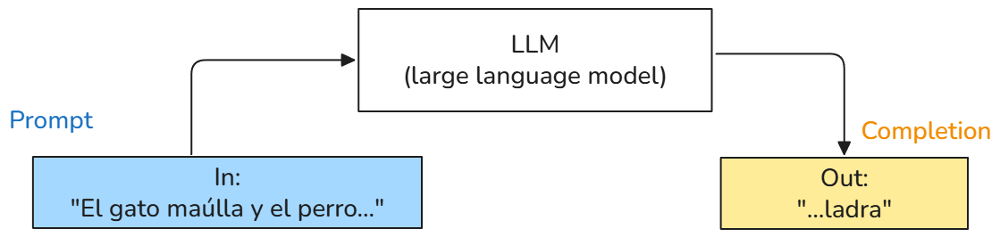
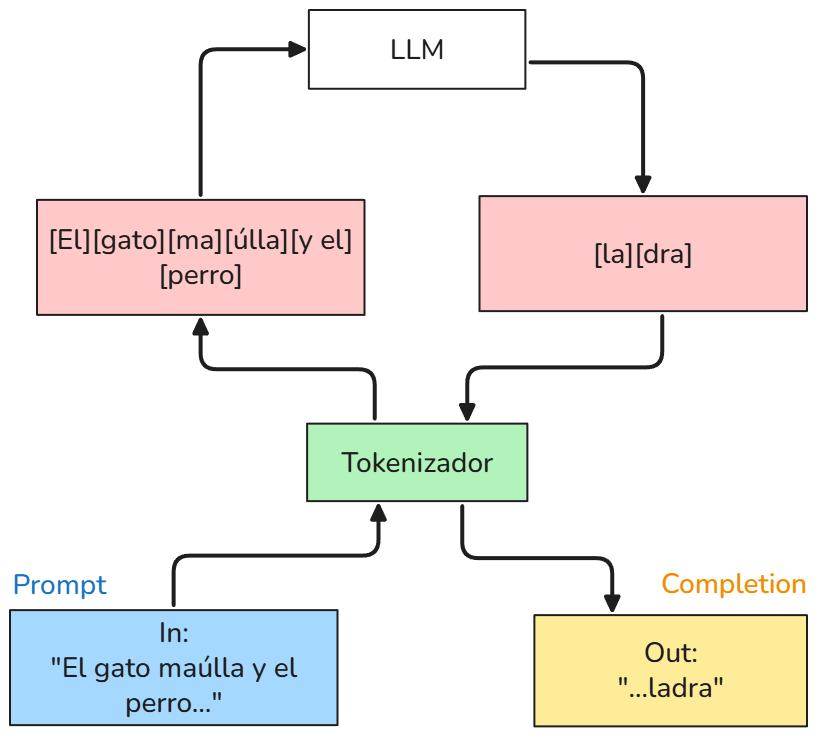
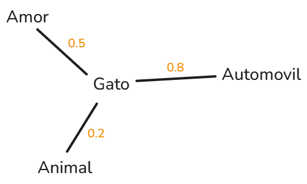
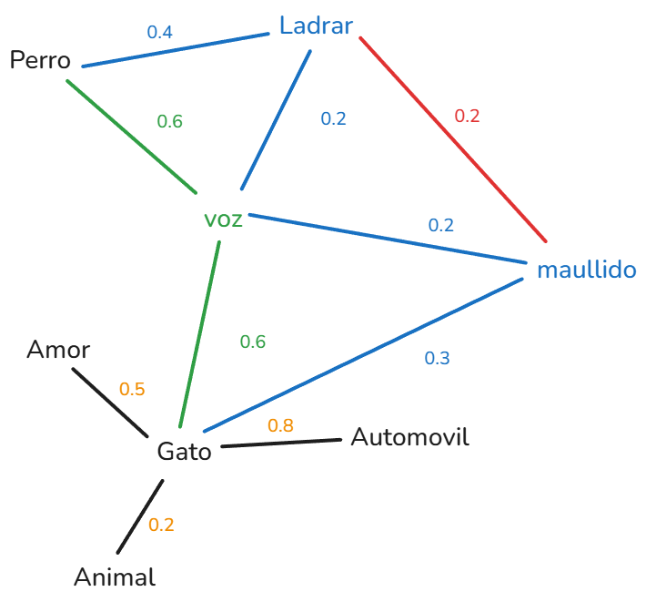

### Módulo 1:  Fundamentos de LLMs 🚀

- ¿Qué es un LLM? <!-- .element: class="fragment" -->
- Cómo percibe el mundo un LLM <!-- .element: class="fragment" -->
- Consideraciones clave <!-- .element: class="fragment" -->
- Modelo de razonamiento <!-- .element: class="fragment" -->

### ¿Qué es un LLM? 🤖

Es un tipo de **inteligencia artificial** (IA) diseñado para entender y **generar texto** de manera similar a como lo hacemos nosotros. 🧠

> Es una máquina que ha leído mucho y puede conversar, responder preguntas o ayudarte a escribir. 💬
<!--  .element: class="fragment" -->

note: Un LLM es un tipo de inteligencia artificial diseñado para entender y generar texto de manera similar a como lo hacemos los humanos. Se le llama “grande” porque ha sido entrenado con enormes cantidades de información (libros, artículos, páginas web, conversaciones) y porque cuenta con millones o incluso billones de parámetros (piezas internas que ajustan su “forma de pensar”).

### ¿Cómo funciona a grandes rasgos? ⚙️
Los modelos LLM **predicen** cuál debería ser la **siguiente palabra** para complementar la información, basándose en **probabilidad y estadística**.

<!--  .element: class="fragment" -->

### Cómo percibe el mundo los LLMs 🌎

note:
* Los LLMs no leen letras individuales, sino agrupaciones de letras o palabras.
* El primer paso al enviar un prompt es tokenizar el texto, convirtiéndolo en un código numérico comprensible para el modelo.
* Cada token suele representar una palabra o grupo de caracteres, dependiendo de la configuración.
* Los caracteres especiales, como puntos o emojis, pueden dividirse en varios tokens.

### Cómo se correlacionan los tokens 🔗

Tokenizar el lenguaje consiste en dividir el texto en partes más pequeñas, llamadas tokens. Estos tokens son luego convertidos en vectores numéricos que el modelo puede entender.

<!--  .element: class="fragment" -->

Para nuestro ejemplo: *"El gato maúlla y el perro..."*

### Modelos Razonadores 🧩

Es una inteligencia artificial que, en lugar de solo dar una respuesta, **descompone** un problema en pasos lógicos para **"pensar"** y encontrar la mejor solución.

1. **Comprender:** Analiza a fondo la pregunta.
2. **Planificar:** Crea un plan o "cadena de pensamiento".
3. **Ejecutar:** Sigue el plan, usando herramientas si es necesario.
4. **Verificar:** Revisa y corrige su propio trabajo.
5. **Responder:** Entrega la solución final. ✅

### Consideraciones clave ⚠️

- **Alucinaciones:** Ocurrencias donde el modelo genera información incorrecta o inventada.
- **Limitación de los datos:** Dependencia de la calidad y cantidad de datos de entrenamiento.
- **Pensamiento humano:** Dificultad para replicar la retroalimentación humana.