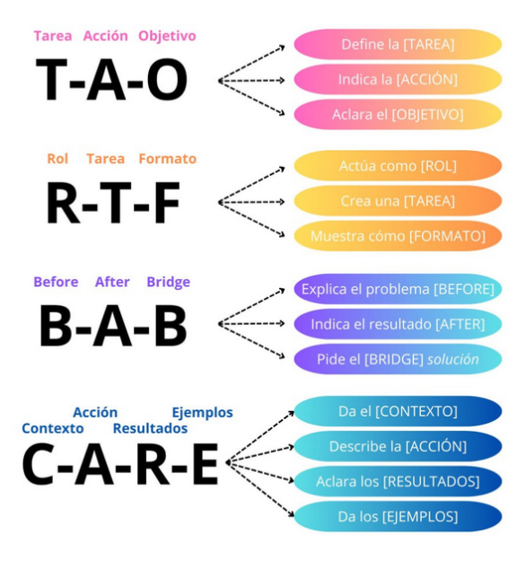
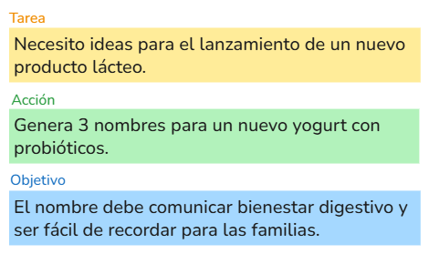
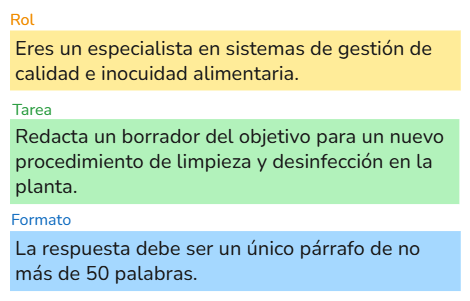
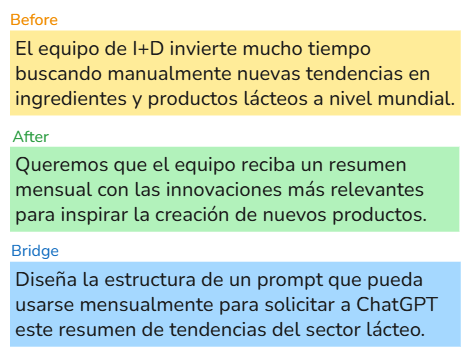
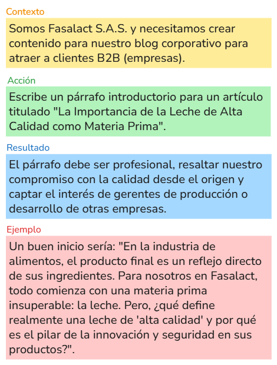

### Módulo 2:<br> Prompt Engineering 🚀✨

- 🏗️ Los 4 Pilares de un Prompt  <!-- .element: class="fragment" data-fragment-index="1" -->
- 🧠 Técnicas Fundamentales:<!-- .element: class="fragment" data-fragment-index="2" --> **Zero-shot**<!-- .element: class="fragment" data-fragment-index="2" -->, **Few-shot**<!-- .element: class="fragment" data-fragment-index="2" -->, **Chain-of-Thought**<!-- .element: class="fragment" data-fragment-index="2" -->, **Tree-of-Thoughts**<!-- .element: class="fragment" data-fragment-index="2" -->
- 📝 Uso de formatos para mejorar la precisión y el contexto  <!-- .element: class="fragment" data-fragment-index="4" -->


### Los 4 Pilares de un Prompt 🏗️

- **Rol:** ¿Quién debe ser la IA?
- **Contexto:** ¿Por qué se realiza la tarea?
- **Tarea:** ¿Qué acción debe ejecutar?
- **Formato:** ¿Cómo debe ser la respuesta?


### Estructuras de un Prompt 🧩




#### Ejemplo: T-A-O



note:
Necesito ideas para el lanzamiento de un nuevo producto lácteo.

Genera 3 nombres para un nuevo yogur con probióticos.

El nombre debe comunicar bienestar digestivo y ser fácil de recordar para las familias.


#### Ejemplo: R-T-F



note:
Eres un especialista en sistemas de gestión de calidad e inocuidad alimentaria.

Redacta un borrador del objetivo para un nuevo procedimiento de limpieza y desinfección en la planta.

La respuesta debe ser un único párrafo de no más de 50 palabras.


#### Ejemplo: B-A-B



note:
El equipo de I+D invierte mucho tiempo buscando manualmente nuevas tendencias en ingredientes y productos lácteos a nivel mundial.

Queremos que el equipo reciba un resumen mensual con las innovaciones más relevantes para inspirar la creación de nuevos productos.

Diseña la estructura de un prompt que pueda usarse mensualmente para solicitar a ChatGPT este resumen de tendencias del sector lácteo.


#### Ejemplo: C-A-R-E



note:
Somos Fasalact S.A.S. y necesitamos crear contenido para nuestro blog corporativo para atraer a clientes B2B (empresas).

Escribe un párrafo introductorio para un artículo titulado "La Importancia de la Leche de Alta Calidad como Materia Prima".

El párrafo debe ser profesional, resaltar nuestro compromiso con la calidad desde el origen y captar el interés de gerentes de producción o desarrollo de otras empresas.

Un buen inicio sería: "En la industria de alimentos, el producto final es un reflejo directo de sus ingredientes. Para nosotros en Fasalact, todo comienza con una materia prima insuperable: la leche. Pero, ¿qué define realmente una leche de 'alta calidad' y por qué es el pilar de la innovación y seguridad en sus productos?".


### Técnicas de Prompt Engineering 🛠️

- **Zero-shot 🎯** 
- **Few-shot 📚** 
- **Chain-of-Thought 🧠➡️**
- **Tree-of-Thoughts 🌳➡️**


### Zero-shot 🎯

Consiste en pedirle al modelo que haga una tarea solo con la instrucción, sin ejemplos.

**Úsalo:** Para tareas simples que el modelo ya conoce, como traducir, resumir o clasificar sentimientos.
<!-- .element: class="fragment" data-fragment-index="1" -->

note:
Es la forma más simple y directa de interactuar con un LLM.

Gracias a su vasto entrenamiento, entienda y la ejecute correctamente.

**Analogía:** Es como pedirle a un chef experimentado que te prepare un "omelette" sin darle la receta. Asumes que ya sabe lo que es y cómo hacerlo.

**Ejemplo:** Extrae la siguiente información del texto y preséntala en formato JSON: nombre_completo, cargo, empresa, email y telefono. Si un campo no está presente, déjalo como "N/A".

Texto a analizar:
"Hola equipo, les presento a María Rodriguez, la nueva Directora de Marketing de 'Innovate Corp'. Su correo es m.rodriguez@innovatecorp.com. Me comentó que su número principal es el 555-0102. Saludos, Juan."


### Few-shot 📚

Consiste en mostrarle al modelo algunos ejemplos de lo que esperas como entrada y salida.

**Úsalo:** Cuando la tarea es más compleja, requiere un formato específico o buscas mayor control en la respuesta.
<!-- .element: class="fragment" data-fragment-index="1" -->

note:
Permite guiar al modelo con ejemplos concretos, mejorando la precisión y el estilo de la respuesta.

**Analogía:** Es como pedirle a un chef un platillo y mostrarle fotos de cómo quieres que se vea el resultado final.

**Ejemplo:**
Escribe una reseña de experto para el nuevo producto, siguiendo el estilo y formato de los ejemplos.

**Ejemplo 1:**
Producto: Audífonos "AuraSound Pro"
Reseña:
Los AuraSound Pro son una maravilla para los audiófilos.
(+) Calidad de sonido cristalina y bajos profundos.
(+) Cancelación de ruido líder en su clase.
(-) La batería podría ser un poco mejor.
Veredicto: 9/10 - Imprescindibles si buscas la mejor calidad de audio.

**Ejemplo 2:**
Producto: Teclado Mecánico "KeyMaster V2"
Reseña:
El KeyMaster V2 es el sueño de todo programador y gamer.
(+) Switches mecánicos con una respuesta táctil increíble.
(+) Construcción robusta en aluminio.
(-) El software de personalización es algo confuso.
Veredicto: 8.5/10 - Una inversión sólida para tu escritorio.

**Nuevo Producto:**
Producto: Webcam "StreamView 4K"
Características: Resolución 4K, autoenfoque con IA, aro de luz integrado.
Reseña:


### Chain-of-Thought 🧠➡️

Consiste en pedirle al modelo que explique su razonamiento paso a paso antes de dar la respuesta final.

**Úsalo:** Para problemas que requieren lógica, cálculos o varios pasos para llegar a la solución.
<!-- .element: class="fragment" data-fragment-index="1" -->

note:
Obligar al modelo a "pensar en voz alta" ayuda a obtener respuestas más precisas y fundamentadas.

**Analogía:** Es como resolver un problema de matemáticas mostrando todos los pasos, no solo la respuesta final.

**Ejemplo:**
Pregunta: Juan tiene 5 cajas de lápices. Cada caja contiene 12 lápices. Si le regala 3 lápices a Ana, ¿cuántos le quedan?
Razonamiento:
1. 5 cajas × 12 = 60 lápices.
2. 60 - 3 = 57 lápices.
Respuesta final: 57 lápices.


### Marcado de texto (Markdown) 📝

- Lenguaje ligero para dar formato legible: encabezados, listas, enlaces y énfasis. <!-- .element: class="fragment" data-fragment-index="1" -->
- En prompts, ayuda a estructurar instrucciones y salidas con claridad y consistencia. <!-- .element: class="fragment" data-fragment-index="2" -->
- Separa contenido de presentación: te enfocas en qué decir, no en cómo se ve. <!-- .element: class="fragment" data-fragment-index="3" -->
- Pide el formato deseado (listas, tablas o secciones) para respuestas más precisas. <!-- .element: class="fragment" data-fragment-index="4" -->

note:
Usa Markdown para definir plantillas de salida: títulos H2, secciones numeradas, listas de verificación o tablas. Esto reduce ambigüedad y facilita evaluación y reutilización.


<!-- .slide: data-background-iframe="https://markdownlivepreview.com/" -->


### Tree of Thoughts (ToT) 🌳🧠

- Técnica para explorar varias líneas de razonamiento en paralelo.
- En lugar de un camino lineal (CoT), organiza ideas como un árbol con ramas.
- Útil para planificación, estrategia, acertijos y escritura creativa.

note:
ToT permite que el modelo considere múltiples rutas, compare y elija la mejor.
Frente a CoT (lineal), ToT eleva la probabilidad de buenas soluciones en problemas complejos.


### Cómo funciona ToT ⚙️

1) 🌱 Genera ramas: posibles pasos/ideas siguientes.
2) 🧮 Autoevalúa cada rama: puntúa su viabilidad.
3) 🔙 Retrocede (backtracking): descarta ramas débiles y sigue las prometedoras.
4) 🔁 Itera hasta resolver o alcanzar límites (profundidad/tiempo/ancho de búsqueda).

note:
🌳 Piensa en un árbol de decisiones: explorar → evaluar → podar.
Criterios típicos: puntaje del modelo, límite de profundidad/ancho, tiempo o confianza.

Destaca el patrón: generar → evaluar → retroceder/seleccionar.
Aplica a acertijos, planificación, código y contenido creativo.
Tip: si el tiempo es limitado, reduce profundidad o ancho; usa una evaluación heurística simple (1–10).

**Ejemplo:**
```markdown
**Objetivo:** Diseñar y seleccionar la estrategia de marketing más efectiva para aumentar el consumo del yogur griego *Sketos* entre jóvenes de 18 a 25 años.

**Instrucciones:**

1. **Genera hasta 5 estrategias de marketing distintas** enfocadas en el público objetivo (jóvenes de 18 a 25 años).

2. Para **cada estrategia**, incluye:

   * **Resumen de la idea** (máximo 40 palabras).
   * **Canales clave a utilizar** (p. ej.: TikTok, Instagram, punto de venta, colaboraciones con influencers).
   * **Riesgos principales** (p. ej.: alto costo, baja interacción, saturación del canal).
   * **Evaluación del impacto potencial** (califica de 1 a 10 según tu estimación de efectividad, considerando factores como viralidad, conexión con el público objetivo, escalabilidad y costo; justifica el valor dado).
   * **Breve análisis de ROI estimado** (retorno en relación con la inversión).

3. **Condición de backtracking:**
   Si **ninguna estrategia obtiene una puntuación mayor a 7**, elige la mejor valorada, propón una **versión mejorada de esta estrategia** (ajusta el enfoque, canal, mensaje u otros elementos clave), y vuelve a evaluarla.

4. **Selección final:**
   Elige la estrategia con **el mayor puntaje final** y justifica tu elección basándote en:

   * Su potencial de ROI.
   * Nivel de alineación con la marca Sketos (identidad, valores, estilo).
   * Relevancia cultural para el público objetivo.

**Formato de salida esperado:**

* Muestra el razonamiento implementado
* Lista numerada de estrategias (máximo 5).
* Evaluación completa de cada una.
* Estrategia final seleccionada con su justificación clara.
```


## ¡Gracias!

note:
💬 Agradece y abre espacio para preguntas y discusión.